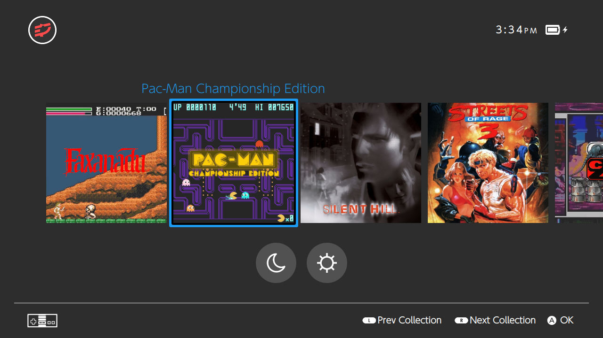
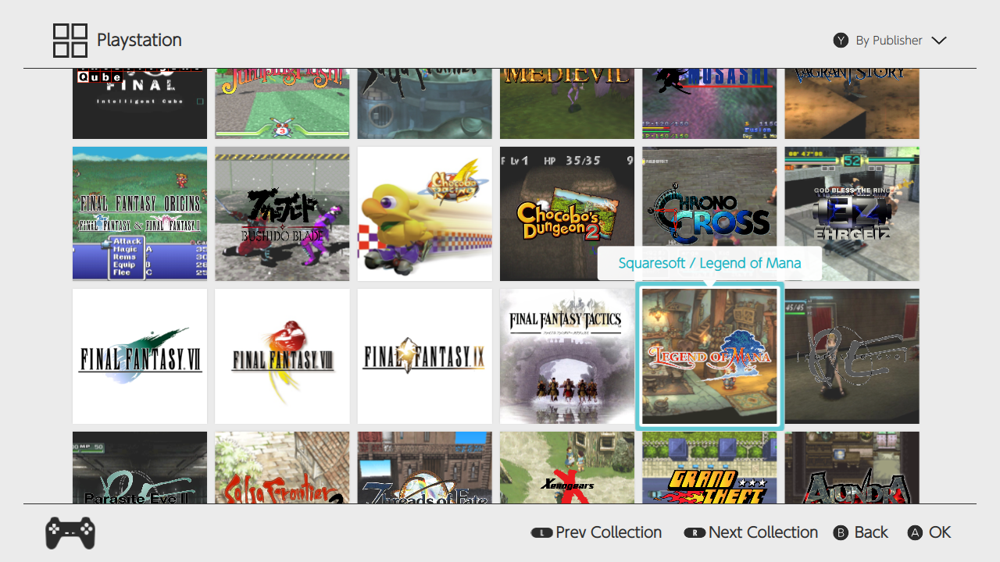

# skylineOS v0.9.4

A clean and simple theme that aims to recreate the experience of Nintendo's Switch console. skylineOS is a theme for [Pegasus Frontend](http://pegasus-frontend.org/) forked from switchOS.

## Installation

Simply download the theme and place it in your [Pegasus theme directory](http://pegasus-frontend.org/docs/user-guide/installing-themes/) under a folder called skylineOS.

See [wiki](https://github.com/RBertoCases/skylineOS/wiki) for more information.

## Version history

v0.9.4

- Increased MouseArea for the Sort Button on the Software Screen
- General system stability improvements have been made to enhance the user's experience.

v0.9.3

- Disabled the dropshadow on the Software Screen tiles to fix blur
- Fixed mouse/touch functionality on Settings Screen
- General system stability improvements have been made to enhance the user's experience.

v0.9.2

- Added an option to the Settings Screen to set Word Wrap on the highlight titles of the games (On by default)
- Fixed the Fanart option so they actually appear on the Software Screen
- Smoother scrolling on the Software Screen
- General system stability improvements have been made to enhance the user's experience.

v0.9

- Added Settings Screen with the following options:
  - Switch between Screenshots and Fanart as the first preference for game backgrounds.
  - Switch time format between 12 and 24 hour formats.
- tile assets are now pulled for game tiles if set in metadata (Example: assets.tile: {file.path})
- General system stability improvements have been made to enhance the user's experience.

v0.8

- Moved the Toggle Theme functionality to a menu button on the Home Screen.
- The selected Sort Option on the Software Screen is now saved.
- Made visual and audio adjustments including adding drop shadows and new sound effects.
- General system stability improvements have been made to enhance the user's experience.

v0.7

- Smoother scrolling on the Software Screen. @timbiscuits
- Made the Sort, Theme, Prev & Next Collections button prompts clickable for better accessibility.
- Behavior change on the game tiles: Now if you have a screenshot, but no logo, game title text does do not appear in the tile. This is useful if you want to set custom artwork as the screenshot that already includes a logo

v0.6

- Added ability to toggle between light and dark themes

v0.5

- Added sort options on Software Screen
- Fixed Steam logos on Software Screen

v0.4

- Added "All Software" collection
- List and launch recent last played from platform bar for each collection
- List and launch all last played in software screen for each collection
- changed time to 12 hour format to better match Switch

Forked from switchOS

v0.3

- Added proper support for variable aspect ratios without decreasing size. Now properly supports 4:3 aspect ratios and should look correct on smaller screens
- Added logos or collection text for missing eslogos
- Fixed issue with navigation audio

v0.2.2

- Fixed bottom bar alignment on non-16:9 screens

v0.2.1

- Removed Qt.QML inclusion as it apparently is no longer supported

v0.2

- Adding new platform logos courtesy of [lilbud](https://github.com/lilbud/es-theme-switch)

v0.1

- Initial release
