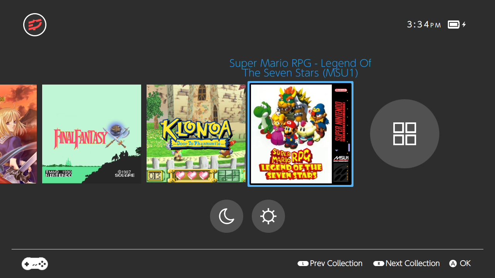
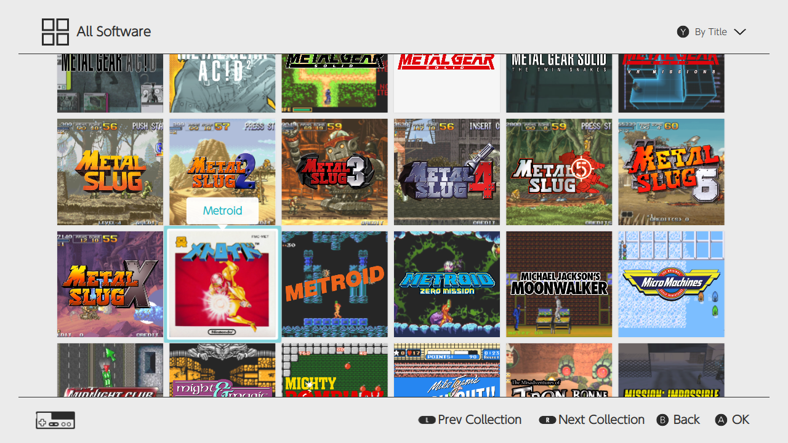

# skylineOS v0.4

## skylineOS theme for Pegasus Frontend

A simple theme that aims to recreate the experience of Nintendo's Switch console. skylineOS is a theme for [Pegasus Frontend](http://pegasus-frontend.org/) forked from switchOS.

## Installation

Simply download the theme and place it in your [Pegasus theme directory](http://pegasus-frontend.org/docs/user-guide/installing-themes/) under a folder called skylineOS.

## Version history
v0.4
- Added "All Software" collection
- List and launch recent last played from platform bar for each collection
- List and launch all last played in software screen for each collection
- changed time to 12 hour format to better match Switch

v0.3
- Added proper support for variable aspect ratios without decreasing size. Now properly supports 4:3 aspect ratios and should look correct on smaller screens
- Added logos or collection text for missing eslogos
- Fixed issue with navigation audio

v0.2.2
- Fixed bottom bar alignment on non-16:9 screens

v0.2.1
- Removed Qt.QML inclusion as it apparently is no longer supported

v0.2
- Adding new platform logos courtesy of [lilbud](https://github.com/lilbud/es-theme-switch)

v0.1
- Initial release
